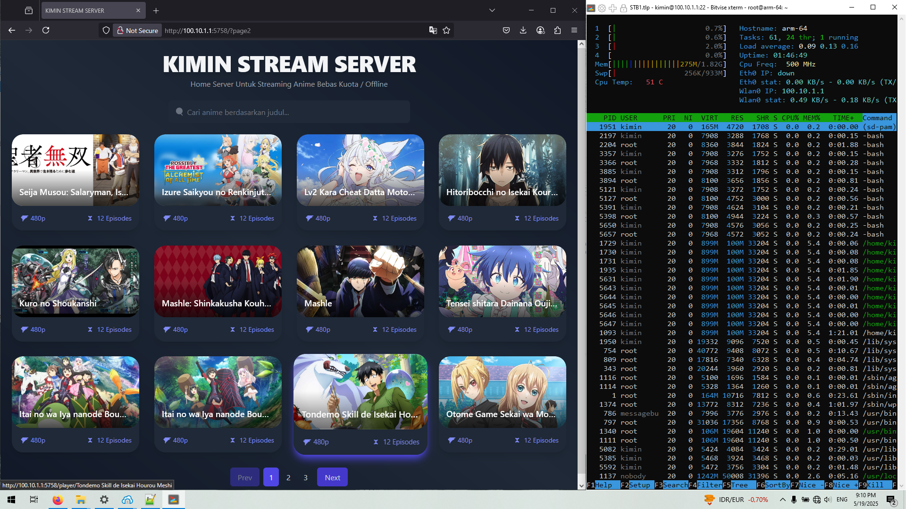
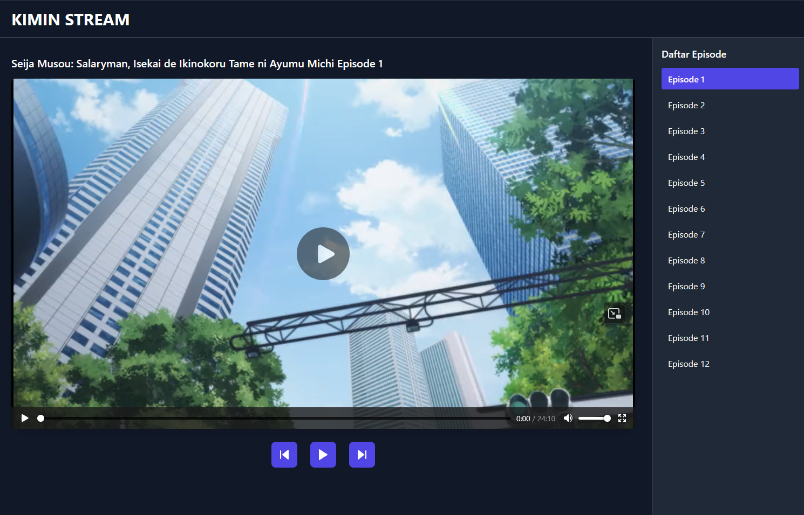
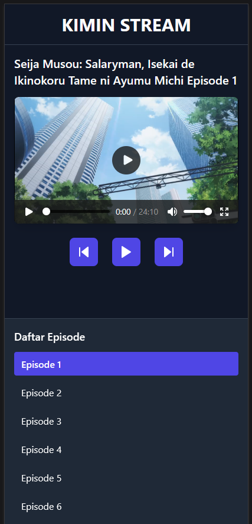

# Stream_Anime

<p align="center">
  
  
  
  
</p>

Panduan lengkap untuk menginstall dan menjalankan Kimin-Stream-Server di STB dengan OS Armbian64.

Panduan ini dibuat agar siapapun bisa mengikuti dengan mudah.

---

## 1. Install Python 3.9 Minimal

Python versi 3.9 diperlukan agar aplikasi dapat berjalan dengan baik.

**Langkah:**

  - Buka terminal (Ctrl+Alt+T atau akses via SSH).
  - Update paket sistem:
      ```bash
        sudo apt update
      ```
  - Install software-properties-common agar bisa menambah repository PPA:
      ```bash
        sudo apt install -y software-properties-common
      ```
  - Tambahkan repository Python 3.9:
      ```bash
        sudo add-apt-repository ppa:deadsnakes/ppa -y
        sudo apt update
      ```
  - Install Python 3.9 beserta paket pendukung:
      ```bash
        sudo apt install -y python3.9 python3.9-venv python3.9-dev unzip wget
      ```
  - (Opsional) Jadikan python3.9 sebagai default python:
      ```bash
        sudo update-alternatives --install /usr/bin/python python /usr/bin/python3.9 1
      ```
  - Cek versi python:
      ```bash
        python --version
      ```
      Output yang diharapkan minimal:
        
      ```bash
        Python 3.9.x
      ```
---

## 2. Download Source Code Kimin-Stream-Server

Sumber aplikasi akan diunduh dan diekstrak.

**Langkah:**
    
  - Pindah ke direktori home user:
      ```bash
        cd ~
      ```
  - Unduh file zip source code menggunakan wget:
      ```bash
        wget https://codeload.github.com/staykimin/Stream_Anime/zip/refs/heads/kimin -O Stream_Anime-kimin.zip
      ```
  - Ekstrak zip:
      ```bash
        unzip Kimin-Stream-Server.zip
      ```
  - Masuk ke folder aplikasi:
      ```bash
        cd Stream_Anime-kimin
      ```
---

## 3. Membuat Virtual Environment dan Install Dependencies

Virtual environment berguna untuk mengisolasi paket Python agar tidak bentrok dengan sistem.

**Langkah:**

  - Buat virtual environment:
      ```bash
        python3.9 -m venv venv
      ```
  - Aktifkan virtual environment:
      ```bash
        source venv/bin/activate
      ```
  - Install paket yang diperlukan dari file `mdl.min`:
      ```bash
        pip3.9 install -r mdl.min
      ```
  - Setiap kali ingin menjalankan server secara manual, aktifkan dulu virtual environment dengan `source venv/bin/activate`.

---

## 4. Konfigurasi Server

File konfigurasi `cfg/server_cfg.min` berisi pengaturan utama server, termasuk lokasi file anime, port, alamat host, dan setting API.

### Contoh `./cfg/server_cfg.min`:
```json
  {
 "system":{
     "import_config":true,
     "builder_log":false
 },
 "log":{
     "show_log":true,
     "path":"log",
     "notif":{
         "status":false,
         "token":"<<token_bot_tele>>",
         "id_account":"<<userid_bot_tele>>",
         "static_text":"⚠️ Terjadi Error ‼️ \n\n"
     }
 },
 "server": {
     "base_path":"/mnt/Data_Server1/Data",
     "debug": true,
     "template_auto_reload": true,
     "session_lifetime": false,
     "https":false,
     "ws_host":"<<url_ngrok>>",
     "port": 5758,
     "host": "0.0.0.0",
     "secret_key": "Kimin-Streaming-Server",
     "static_path": "bin",
     "template_path": "tampilan"
 },
 "routes": {
     "modul_name": "Routes.routes",
     "class_name": "Routes",
     "API":{
         "url":"/api/{version}/{mode}",
         "methods":["GET", "POST"],
         "function": "API"
     },
     "Player":{
         "url":"/player/{path}",
         "methods":["GET"],
         "function": "Player"
     },
     "Home":{
         "url":"/",
         "methods":["GET"],
         "function":"Home"
     }
 }
}
```

Penjelasan bagian penting:
- **"base_path":"/mnt/Data_Server1/Data"**

    Ini adalah lokasi di mana semua data anime disimpan di HDD. Contohnya, kamu harus mount HDD kamu ke folder **/mnt/Data_Server1** dan di dalamnya harus ada folder Data yang berisi folder-folder anime. 
- **Port dan host ("port": 5758, "host": "0.0.0.0")**
    
    Server akan berjalan di port 5758 dan bisa diakses dari semua alamat IP.
- **"ws_host"**

    Diisi dengan alamat WebSocket (misalnya ngrok jika pakai tunneling).
- Token dan ID Telegram diisi jika kamu ingin mengaktifkan notifikasi error lewat bot Telegram.

## 5. Struktur Folder Anime di HDD

Folder HDD yang kamu mount harus memiliki struktur seperti ini:
```bash
  /mnt/Data_Server1/Data/
  ├── Naruto/
  │   ├── episode1.mp4
  │   ├── episode2.mp4
  │   ├── thumbnail.png
  │   └── cover.jpg
  ├── OnePiece/
  │   ├── ep1.mp4
  │   ├── ep2.mp4
  │   ├── thumbnail.jpg
  │   └── cover.png
  └── dst...
```

- Folder paling atas (Data) berisi banyak folder anime.
- Nama folder anime adalah nama anime itu sendiri.
- Di dalam folder anime terdapat file video **.mp4** dan file gambar **.png** atau **.jpg** untuk thumbnail atau cover.

---

## 6. Membuat Script Mount Otomatis HDD

Buat script shell **Data_Server1.sh** di **/home/kimin/**
  ```bash
      #!/bin/bash

      # Cek apakah device /dev/sda1 tersedia
      if lsblk /dev/sda1; then
          # Jika ada, mount device tersebut ke /mnt/Data_Server1
          mount /dev/sda1 /mnt/Data_Server1 || echo "Failed to mount /dev/sda1"
      else
          echo "/dev/sda1 tidak ditemukan"
      fi
  ```

**Langkah:**

  - Buat file dengan editor teks, misal **nano /home/kimin/Data_Server1.sh**.
  - Paste isi di atas.
  - Simpan dan keluar.
  - Jadikan file executable:
      ```bash
        chmod +x /home/kimin/Data_Server1.sh
      ```

---


## 7. Setup Service Systemd untuk Auto Mount HDD


  - Setup Service Systemd untuk Auto Mount HDD
      
      Buat file **/etc/systemd/system/auto-mount.service**
      ```bash
          [Unit]
          Description=Auto Mount HDD
          After=multi-user.target

          [Service]
          ExecStart=/bin/sh /home/kimin/Data_Server1.sh
          Type=oneshot
          RemainAfterExit=yes

          [Install]
          WantedBy=multi-user.target

      ```
  - Service mount HDD /mnt/Data_Server1

      Buat file **/etc/systemd/system/auto-mount.service**
      ```bash
        [Unit]
        Description=Auto Mount HDD
        After=multi-user.target

        [Service]
        ExecStart=/bin/sh /home/kimin/Data_Server1.sh
        Type=oneshot
        RemainAfterExit=yes

        [Install]
        WantedBy=multi-user.target

      ```
  - Service mount HDD /mnt/Data_Server1

      Buat file **/etc/systemd/system/mnt-data.mount**
      ```bash
        [Unit]
        Description=Mount /mnt/Data_Server1
        Requires=dev-sda1.device
        After=dev-sda1.device
        Wants=network-online.target
        After=network-online.target
        TimeoutSec=30

        [Mount]
        What=/dev/sda1
        Where=/mnt/Data_Server1
        Type=ext4
        Options=defaults

        [Install]
        WantedBy=multi-user.target

      ```
  - Membuat folder mountpoint (jika belum ada)
    ```bash
      sudo mkdir -p /mnt/Data_Server1
    ```
  - Reload dan aktifkan service

    ```bash
      sudo systemctl daemon-reload
      sudo systemctl enable auto-mount.service
      sudo systemctl enable mnt-data.mount
      sudo systemctl start auto-mount.service
      sudo systemctl start mnt-data.mount
      sudo systemctl status auto-mount.service
      sudo systemctl status mnt-data.mount

    ```

---

## 8. Setup Service Systemd untuk Menjalankan Kimin-Stream-Server Otomatis

 
  - Buat file service **/etc/systemd/system/kimin-home-server.service**
      ```bash
        [Unit]
        Description=Kimin Home Server Server 1
        After=network.target

        [Service]
        User=kimin
        WorkingDirectory=/home/kimin/Streaming_Anime
        ExecStart=/home/kimin/venv/bin/python /home/kimin/Streaming_Anime/v1.py
        Restart=always
        Environment="PYTHONUNBUFFERED=1"

        [Install]
        WantedBy=multi-user.target

      ```

      Penjelasan:
      - **User=kimin** → jalankan service sebagai user kimin
      - **WorkingDirectory** → direktori kerja aplikasi
      - **ExecStart** → jalankan file python aplikasi menggunakan virtualenv
      - **Restart=always** → restart otomatis jika aplikasi crash
  
  - Aktifkan dan jalankan service
      ```bash
        sudo systemctl daemon-reload
        sudo systemctl enable kimin-home-server.service
        sudo systemctl start kimin-home-server.service
        sudo systemctl status kimin-home-server.service

      ```
---


## 9. Menjalankan Server Secara Manual (Opsional)

Kalau ingin coba jalankan server manual tanpa systemd:

  - Aktifkan virtual environment:
      ```bash
        source ~/Kimin-Stream-Server-main/venv/bin/activate
      ```
  - Jalankan aplikasi:
      ```
        python ~/Kimin-Stream-Server-main/v1.py
      ```
---


## 10. Troubleshooting dan Tips

  - Cek status service dengan:
      ```bash
          systemctl status kimin-home-server.service
      ```
  - Cek log service:
      ```bash
          journalctl -u kimin-home-server.service -f
      ```
  - Pastikan HDD **/dev/sda1** benar dengan lsblk.
  - Pastikan folder **/mnt/Data_Server1** sudah ada dan bisa diakses user kimin.
  - Jika mount gagal, cek pesan error di journalctl atau di terminal.
  - Restart semua service setelah edit config atau script:
      ```bash
          sudo systemctl restart auto-mount.service mnt-data.mount kimin-home-server.service

      ```

## 11. Penjelasan Lengkap base_path di Config

**"base_path":"/mnt/Data_Server1/Data"** di **./cfg/server_cfg.min** adalah lokasi root penyimpanan semua file anime.

- **/mnt/Data_Server1** → adalah mount point HDD kamu (pastikan HDD sudah terpasang dan ter-mount dengan benar).
- **/mnt/Data_Server1/Data** → folder khusus di HDD yang berisi folder-folder anime.
- Tiap folder anime di dalam Data berisi file video **.mp4** dan thumbnail **.png/.jpg**.

Server akan membaca semua folder di dalam base_path sebagai daftar anime yang tersedia.

---


